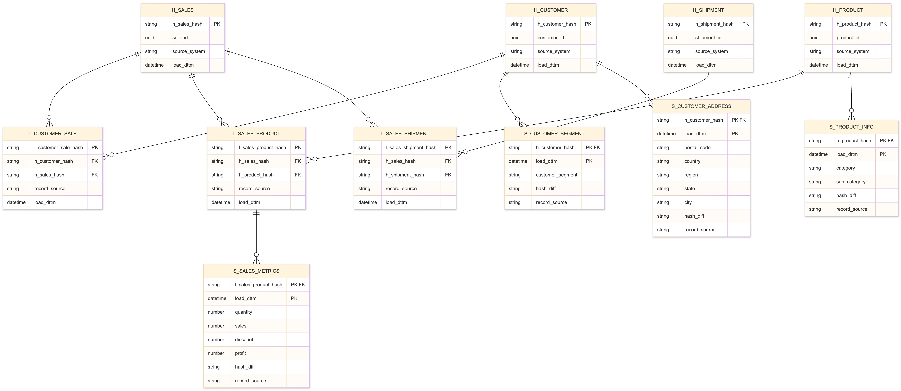

# 🧠 Итоговый проект по модулю  

Проект посвящён построению хранилища данных по методологии **Data Vault** на основе датасета **[superstore](https://www.kaggle.com/datasets/roopacalistus/superstore)**.  

---

### 📘 Содержание репозитория

#### 1. Исходные данные  
Файл **`SampleSuperstore.csv`** — основной датасет, содержащий информацию о заказах, клиентах, товарах и доставках.

#### 2. Подготовка и генерация бизнес-ключей  
Скрипт **`data_loader.py`** выполняет очистку и преобразование данных, а также формирует уникальные бизнес-ключи (UUID), необходимые для построения хабов.  
Результатом работы является файл **`busines_key_data.csv`** — он используется при загрузке данных в хранилище.

#### 3. Структура хранилища  
Модель хранилища реализована в формате **Data Vault** и включает:
- **Хабы (Hubs)** — уникальные бизнес-объекты  
- **Линки (Links)** — связи между объектами  
- **Спутники (Satellites)** — атрибуты и метрики, зависящие от времени  

Диаграмма структуры представлена на изображении ниже:  


#### 4. Создание таблиц  
SQL-скрипт **`create_storage.sql`** создаёт структуру таблиц (хабы, линки и спутники) в схеме `student46`.  
Все таблицы имеют строгие первичные ключи и временные метки загрузки данных (`load_dttm`).

#### 5. Загрузка данных  
Файл **`data_import.py`** выполняет наполнение таблиц хранилища подготовленными данными из `busines_key_data.csv`.  
Загрузка реализована с помощью библиотеки **SQLAlchemy**.

---

### ⚙️ Используемые технологии
- **Python 3.12**
- **Pandas**, **SQLAlchemy**
- **PostgreSQL / Greenplum**
- **Mermaid** (для построения диаграммы)

---

### 🚀 Как запустить проект

1. Создать таблицы в базе данных:
   ```sql
   \i create_storage.sql
   ```
2. Сформировать бизнес-ключи:
   ```python
   python data_loader.py
   ```
3. Загрузить данные в хранилище:
   ```python
   python data_import.py
   ```
