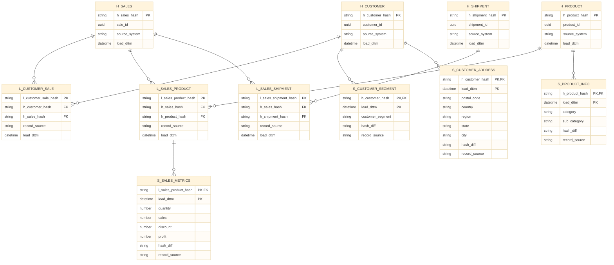

```mermaid
---
config:
  theme: base
---
erDiagram
    direction TB

    H_CUSTOMER {
        string h_customer_hash PK
        uuid customer_id
        string source_system
        datetime load_dttm
    }

    H_SALES {
        string h_sales_hash PK
        uuid sale_id
        string source_system
        datetime load_dttm
    }

    H_PRODUCT {
        string h_product_hash PK
        uuid product_id
        string source_system
        datetime load_dttm
    }

    H_SHIPMENT {
        string h_shipment_hash PK
        uuid shipment_id
        string source_system
        datetime load_dttm
    }

    L_CUSTOMER_SALE {
        string l_customer_sale_hash PK
        string h_customer_hash FK
        string h_sales_hash FK
        string record_source
        datetime load_dttm
    }

    L_SALES_PRODUCT {
        string l_sales_product_hash PK
        string h_sales_hash FK
        string h_product_hash FK
        string record_source
        datetime load_dttm
    }

    L_SALES_SHIPMENT {
        string l_sales_shipment_hash PK
        string h_sales_hash FK
        string h_shipment_hash FK
        string record_source
        datetime load_dttm
    }

    S_CUSTOMER_SEGMENT {
        string h_customer_hash PK,FK
        datetime load_dttm PK
        string customer_segment
        string hash_diff
        string record_source
    }

    S_CUSTOMER_ADDRESS {
        string h_customer_hash PK,FK
        datetime load_dttm PK
        string postal_code
        string country
        string region
        string state
        string city
        string hash_diff
        string record_source
    }

    S_PRODUCT_INFO {
        string h_product_hash PK,FK
        datetime load_dttm PK
        string category
        string sub_category
        string hash_diff
        string record_source
    }

    S_SALES_METRICS {
        string l_sales_product_hash PK,FK
        datetime load_dttm PK
        number quantity
        number sales
        number discount
        number profit
        string hash_diff
        string record_source
    }

    H_CUSTOMER ||--o{ L_CUSTOMER_SALE : ""
    H_SALES ||--o{ L_CUSTOMER_SALE : ""
    H_SALES ||--o{ L_SALES_PRODUCT : ""
    H_PRODUCT ||--o{ L_SALES_PRODUCT : ""
    H_SALES ||--o{ L_SALES_SHIPMENT : ""
    H_SHIPMENT ||--o{ L_SALES_SHIPMENT : ""
    H_CUSTOMER ||--o{ S_CUSTOMER_SEGMENT : ""
    H_CUSTOMER ||--o{ S_CUSTOMER_ADDRESS : ""
    H_PRODUCT ||--o{ S_PRODUCT_INFO : ""
    L_SALES_PRODUCT ||--o{ S_SALES_METRICS : ""
```